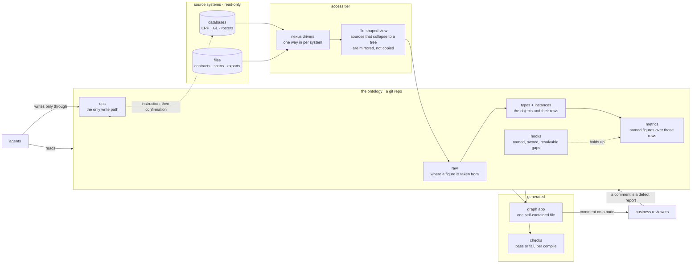

# sudograph

A business ontology as code: one YAML spec → compiler → graph.

Objects, links, and permissioned ops. **Git is the history.**

## Where the decisions live

**All design decisions are recorded in [Sudo Cloud 架构与设计 §7](https://s.shareone.vip/s/sudo-cloud-plan). This repo does not restate them.**

That section covers the harness elements, the SSOT rules, agent working
discipline, the reversibility tiers, the three-layer split, read governance, the
interaction surface, and the two measurement axes. If this README and that page
disagree, the page wins. To change a decision, change the page and comment on the
node there — not here.

This README only covers how to use the repo.

## Where this sits

The spec is the only thing anyone writes. Everything to its left is read-only,
everything to its right is generated from it.



Four properties hold this together, and each is enforced rather than intended:

* **Source systems are read-only.** Connectors take; nothing writes back through
  them. A figure that appears in two independent systems is corroborated because
  they cannot have copied from us.
* **Values are not in the spec.** The spec says where a figure comes from; the
  number arrives at compile time. What is versioned in git is the reasoning, not
  a snapshot of the data.
* **Relationships are generated, never synchronised.** Anything stated twice can
  disagree with itself, so it is stated once and derived everywhere else.
* **Ops are the only write path**, and a write states its intent. Landing a
  change in a source system is an instruction plus a later confirmation, never a
  direct write — the round trip is itself the control.

The dotted line from `ops` back to a source system is the part that is designed
but not built.

This is the shape only. Which technology sits in each box — where the spec is
hosted, which gate governs which kind of write, what has to run inside a
customer's own network — is a deployment matter and lives in the design page
this README defers to, at §7.14.

## The loop this exists to serve

**model → use → iterate**, and all three are one job rather than a setup step
followed by the real work.

| | |
|---|---|
| **model** | An agent arrives at an engagement with the client's source systems and nothing else. It writes the spec: what the objects are, which properties are upstream facts and which are decisions, where the gaps are. |
| **use** | It answers business questions from the graph and takes business actions through ops. Figures are recomputed, never transcribed. |
| **iterate** | Materials arrive, judgements change, the client asks something the model cannot yet answer. The spec changes through ops, and git carries what changed and why. |

Two consequences run through everything else here.

**The modelling is production, not preparation.** Nobody hands the agent a
finished ontology — writing it is the first thing that happens on a real
engagement, which is why how well an agent models from raw materials is a
measurement and not an assumption.

**Iteration is the steady state.** An ontology is never finished, so every
mechanism in this repo is built to survive being changed by someone who did not
write it: gaps are declared rather than remembered, provenance is checked rather
than assumed, and figures are derived rather than typed. A spec that is only
correct while its author is still around is not correct.

How well the loop actually runs is measured, not asserted — the criteria are in
[§7.7](https://s.shareone.vip/s/sudo-cloud-plan) (the two axes) and
[§7.10](https://s.shareone.vip/s/sudo-cloud-plan) (the pilot's switch-over test).

## Layout

```
schema/spec.schema.json   JSON Schema for a spec — the owner rule as validation
examples/*.yaml           fixtures
compiler/
  expr.py                 restricted expression language: parsed, never eval'd
  spec.py                 loading + validation; the owner rule refuses at load
  compile.py              dependency order, values, checks, view model
  diff.py                 two bases -> derived adjusting entries
  lineage.py              lineage, provisionality, completeness — all derived
  history.py              edit timelines, pending proposals
  apply.py                the only path by which anything changes
tools/check_examples.py   CI gate: every example loads, validates, and reconciles
```

## Language

Field names are English because they are the contract. Values keep the
customer's own business vocabulary, because translating business terms loses
them. So `owner: source` and `resolve_when:` are English; `委外合同` and
`可资本化` are not.

## What a spec looks like

See `examples/weiwai-capitalisation.yaml`.

- `types` declare object types; every property carries an `owner`
  (`source` or `ontology`)
- a `ref` property points at another type (a **link**) or at `hook` (a **gap**)
- a `source` property whose `from` is a **list** is corroborated — see below
- `raw` entries are fetch points holding **one executable command**, not data
- `hooks` register gaps by name, with a `resolve_when` and an `owner`
- `nodes` of `kind: derived` carry an `op` expression
- `ops` are write-back actions; `intent` is required
- `bases` hold two sets of figures over one structure — see below

## Links and corroboration

A `ref` points at another type or at `hook`. A link to a type is how one object
reaches another — this payment against that supplier — which is most of what an
audit is. Because a ref stores the target's id, `where 供应商 = '供应商07'` is
plain equality and needs no join.

A figure asserted by one system is a figure taken on trust. Two systems that do
not talk to each other saying the same thing is what audit evidence actually is,
so `from` may be a list, and each source writes the figure on the row:

```yaml
金额:
  type: money
  owner: source
  from: [R-KINGDEE, R-LEDGER]
  corroboration: { at_least: 2, prefer: R-KINGDEE }

# ...and on the rows
- { 科目: "5301-委外开发-2023", 金额@R-KINGDEE: 7170000,  金额@R-LEDGER: 7170000 }
- { 科目: "5301-委外开发-26H1", 金额@R-KINGDEE: 10152000, 金额@R-LEDGER: 10820000,
    缺口: H-台账账面差 }
```

| Outcome | What the compiler does |
|---|---|
| they agree | that value, check passes |
| they disagree | fails, **unless** the row cites a hook *and* `prefer` says which source governs |
| too few spoke | fails against `at_least` |

`prefer` is deliberately not enough on its own: a preference written once would
bury every future disagreement behind it, which is the same silent absorption a
plug with no `residual_to` commits. Writing the figure bare alongside the
per-source values is refused — that would be a third figure with no source.

## Dimensions and bases are not the same kind of thing

The view model's shape says which is which, and the renderer is built against it:

```json
{ "dimensions": { "期间": "2023", "主体": "北京" },   // a dict: they compose
  "basis": "重述" }                                   // a scalar: only one is ever in force
```

**A dimension divides the facts.** The 2023 rows and the 2025 rows are disjoint,
and the periods sum to the whole. So there may be any number of dimensions and
they cross freely — `--at 期间=2023 --at 主体=北京` is one corner of a grid.

**A basis divides nothing.** 账面 and 重述 are each a *complete* reading of all
the facts; there is no total across them. So bases list rather than multiply.

```yaml
dimensions: [期间, 主体]

types:
  委外合同:
    dimensions: { 期间: 期间, 主体: 主体 }   # which prop carries each axis

checks:
  台账总额:   { expr: "委外合计 = 27488000", at: { 期间: null } }   # whole ledger only
  二三年合计: { expr: "委外合计 = 7170000",  at: { 期间: "2023" } }
```

A type that declares no dimension is reference data — people, suppliers — and is
never filtered out, because dropping it would break every row that points at it.

## Named readings, one structure

A restatement is two sets of figures over the same business: what the books say,
and what they should say. The usual shape is two documents plus a hand-written
list of adjusting entries. Then it drifts — a figure moves on one side, the entry
still reads as it did, and the reconciliation is fiction that balances.

Here both live in one spec. Only the expressions that genuinely differ are
written per reading:

```yaml
bases: [账面, 重述]

nodes:
  委外cap:
    op@账面:  "select sum(金额_不含税) from 委外合同 where 认定 = '资本化'"
    op@重述:  "select sum(金额_不含税) from 委外合同 where 认定 = '资本化' and 状态 = '已确认'"
    because: H-待合同          # must cite a raw or a hook, not free text
    entry:
      posts: {借: 研发费用-委外, 贷: 开发支出-委外}   # slots named by the bridge
```

```bash
python -m compiler.cli examples/weiwai-real.yaml --basis 重述
python -m compiler.cli examples/weiwai-real.yaml --diff 账面:重述
python -m compiler.cli examples/weiwai-real.yaml --diff 账面:重述 --at 期间=26H1
```

The entries are **computed from the difference**, never transcribed. Change
either side and the amount moves with it.

| | What it is | Why it is separate |
|---|---|---|
| **entry** | a node whose *expression* differs between bases | this is where the restatement was decided, so this is where it is booked |
| **carried** | a node whose expression is identical but whose value moved anyway | a consequence, not a decision. Booking it would double-count every level of the graph. `origins` names the entries that moved it |
| **unexplained** | a difference with no entry above it | the one outcome this exists to prevent. Reported, and fails CI |

Four refusals hold the shape:

- a node that diverges but declares no `because` — an entry needs a reason
- a `because` that is not a raw or a hook — free text is not provenance
- an `entry` with only one side — half an entry does not balance
- **silence under one basis** — write `op@账面: "0"` if it is genuinely nil
  there. "Nil in the books" and "we have not worked this out" look identical and
  mean opposite things; this is `absent: gap|zero` one level up

And compiling a spec that declares `bases` without naming one is refused
outright. "Which set of figures is this" is not a question a caller may leave
open.

**Readings are a flat list, not a product of dimensions.** There can be as many
as the business has names for — book, restated, tax, management — because each is
a *complete* reading of all the facts. Two rule axes would instead give 2ⁿ
alternative worlds and n(n−1)/2 bridges between them, of which only a couple mean
anything; and nobody says "the figure under book-basis crossed with new-tax", they
say "the tax figure".

Past two readings, the bridges that are deliverables must be declared, and each
reading carries its own reason — "why is the restated figure different" and "why
is the tax figure different" are not the same answer:

```yaml
bases: [账面, 重述, 税务]

bridges:
  重述桥: { from: 账面, to: 重述, label: 会计重述调整 }
  税会差: { from: 重述, to: 税务, label: 税会差异 }
  # 账面 -> 税务 is not declared, because nobody wants that bridge

nodes:
  委外cap:
    op@账面:      "..."
    op@重述:      "..."
    because@重述: H-待合同
    op@税务:      "..."
    because@税务: R-KINGDEE
```

With exactly two readings the single pairing is implied and naming it adds
nothing — generalise on the third instance, not the second.

## The expression language is a SQL subset

The compiler parses it and never calls `eval`, because a spec that can eval hands
execution to the model that wrote it.

```sql
select sum(金额_不含税) from 委外合同 where 认定 = '资本化' and 状态 = '已确认'
select count(*) from 委外合同
委外cap + 待坐实金额                                   -- node values are bare names
(select sum(金额) from 账面委外) - 委外合计             -- nested = scalar subquery
select sum(金额) from 委外合同 where 供应商 = '供应商07' -- a link needs no join
```

A node's whole expression may be a bare `select`; anywhere else an aggregate is a
parenthesised scalar subquery, as in SQL. Keywords are case-insensitive.

`sum`, `count`, `avg`, `min` and `max` work over source or computed properties.
`avg`, `min` and `max` return null for an empty set; `sum` returns zero.
Relationship traversal follows declared, unique scalar refs:

```yaml
# On each Category object, `this` means its identity.
sales:
  type: money
  scale: 2
  op: "select sum(net) from OrderLine where product.category = this"
```

The compiler turns that path into parameterised LEFT JOINs against the existing
SQLite source. Missing targets fail a reference check. It refuses arbitrary JOIN
conditions, composite targets and cross-source SQL. Folding never sums money
columns automatically: a price is money too, so totals need explicit expressions.

- **SQL syntax** is parsed by SQLGlot; `compiler/sql_parser.py` admits the
  supported subset and rejects other constructs with recovery advice
- **why SQL, what is subtracted, and why each subtraction** is [§7.8](https://s.shareone.vip/s/sudo-cloud-plan)
- every subtraction refuses **by name and says where the capability lives**, so
  you meet it at the point of use rather than by reading either of the above

## The graph app

```bash
python -m compiler.cli examples/weiwai-real.yaml --app weiwai.html
```

One self-contained HTML file: selectable SVG + ELK inlined, no network request at
load, opens from disk. An audit deliverable gets read at a client site, and a CDN
reference turns "open this file" into "open this file, on a machine with
internet, on a day the CDN is up".

**The renderer holds no logic.** That rule only survives if the compiler sends
everything the app could need, so it sends *everything*: every reading, every
slice, and the diff across every declared bridge, all computed here. The app
picks; it cannot compute a figure, because it never has the spec. A renderer that
recomputes is a second implementation of the ontology, and the two will disagree
on the day it matters most.

What it shows:

- a data projection for source bindings, identities, columns and declared refs;
  switch to metrics and rules when reviewing business definitions
- generated measurement questions, answers, execution traces and unmeasured
  metrics, under **Measurements**; the score does not certify business meaning
- a reading selector and one selector per dimension — the coordinates of the view
- colour by kind (raw / hook / derived / type), border by completeness
- click a node: its value, the expression *this reading* uses, which hooks make it
  provisional, its direct inputs and the leaves it ultimately rests on — and the
  whole lineage lights up on the canvas
- **bridge view**: the adjusting entries highlighted, the carried movements
  tinted, everything else dimmed. On the real ledger that is 2 nodes out of 55,
  which is the point — you never need to read two full graphs side by side
- instances are off by default: the scalar graph is what a reviewer reads, and 31
  instance nodes against 15 figures shrink every label past reading

Layout is ELK `layered` — this is a DAG read top-down. Fit is clamped so it never
shrinks past legibility; pan and zoom do the rest.

Pass `--lang en` when generating an app for an English UI. Add languages to
`app/messages.json`, preserving every key and placeholder. Domain labels and
compiler diagnostics remain authored in their original language; this does not
translate them automatically. View selectors are presentation controls, not
permissions: the self-contained file contains all bundled views.

## Three gates on every write

`apply.py` refuses in this order, because each gate answers a different question:

| Gate | Question | Refusal |
|---|---|---|
| owner | is this field writable at all? | only `owner=ontology` may be written |
| class | may this actor land it? | `DerivedOp` agent · `RecordableOp` human · `BlockedOp` nobody |
| intent | why is it changing? | required, and must cite an existing raw or hook |

A write that passes all three appends an edit record beside the spec:

```yaml
- at: '2026-09-23T13:42:32Z'
  by: agent:scode-1
  op: 标记可资本化
  target: 委外合同/C-003
  changes:
    - { prop: 可资本化, from: 待补, to: 是 }
  intent: OCR 后读出 IP 条款第十二条，知识产权归甲方
  refs: [R-CONTRACT, H4-委外待补]
```

That record travels with the spec into git, so there is no second place where
"what changed and why" could disagree with the graph.

## Running it

Requires Python 3.11+. Install the pinned runtime dependencies with
`pip install -r requirements.txt` (PyYAML and SQLGlot).

```bash
python -m compiler.cli examples/weiwai-capitalisation.yaml        # values + checks
python -m compiler.cli examples/weiwai-capitalisation.yaml --view # view model JSON
python -m compiler.cli examples/northwind.yaml                    # a spec over a live database
python -m compiler.cli examples/northwind.yaml --measure          # ask it questions it generates itself
python -m pytest                                                  # tests
python -m tools.verify                                            # everything CI runs
```

`tools.verify` holds the list of gates, and CI runs that same module rather than
listing them again. Two lists of the same steps drift, and they drift by the
local one getting shorter: this build was red for five commits on a lint gate
while every local run — the test suite alone — came back green.

One of those gates runs every `python -m` line on this page. That is the only
reason to trust it: the front page is what a model reads before writing its
first spec, so a command here that no longer works is the tool being broken for
its main reader, in the one place no import-level test looks.

Exit codes are a branching protocol, so a calling agent can tell the cases apart
without parsing prose: `0` green · `2` the spec (or the invocation) is wrong ·
`3` the spec is valid but a check failed · `4` the spec is fine and the data it
reads is not reachable from here · `1` a bug in the tool.

`4` is apart from `2` because it is the one failure that is nobody's mistake: a
spec bound to a customer's warehouse is correct on a laptop that cannot see the
warehouse. Folded into "your spec is wrong" it sends the reader to edit a file
that is right.

## References

Three implementations we read before designing this one. Each took a different
position, and the differences are the reason several rules here are phrased the
way they are.

| Repo | What it is | What we took, or deliberately did not |
|---|---|---|
| [TheApeironLab/ontology](https://github.com/TheApeironLab/ontology) | A Palantir-Foundry-shaped ontology engine on PostgreSQL: objects, links, action types, markings | The closest in spirit. We took the per-property owner split, the audit spine with a required intent, approval defaulting to two people, and the eval harness shape. We did not take PostgreSQL as the store — the spec lives in git, so history and rollback come for free |
| [fuyuxiang/ontology](https://github.com/fuyuxiang/ontology) (元枢) | A Python/Vue platform where an LLM drafts the ontology from documents and schemas | The wizard idea is right, and its prompts deliberately avoid modelling jargon when talking to business users. But human corrections there live only in browser storage, so the loop never closes. That is why edit records here are structured and versioned |
| [microsoft/Ontology-Playground](https://github.com/microsoft/Ontology-Playground) | A static teaching site and catalogue for Microsoft Fabric IQ | Worth borrowing for interaction patterns — inspector panels, path finding, honest "lost anchor" behaviour. Not for the data model: its RDF/OWL carries 956 classes and zero `rdfs:subClassOf`, so the standard's syntax is paid for without its semantics |

## Data discipline

- Specs go into git; **source material does not** — scans, statements and
  contract PDFs are data, not spec
- Credentials never enter a spec, and never enter this repo
- Suppliers in the fixture are desensitised to an industry and a line of
  business; amounts are rescaled, but the with-tax to without-tax relationship
  is real, because that is the part the compiler has to get right
